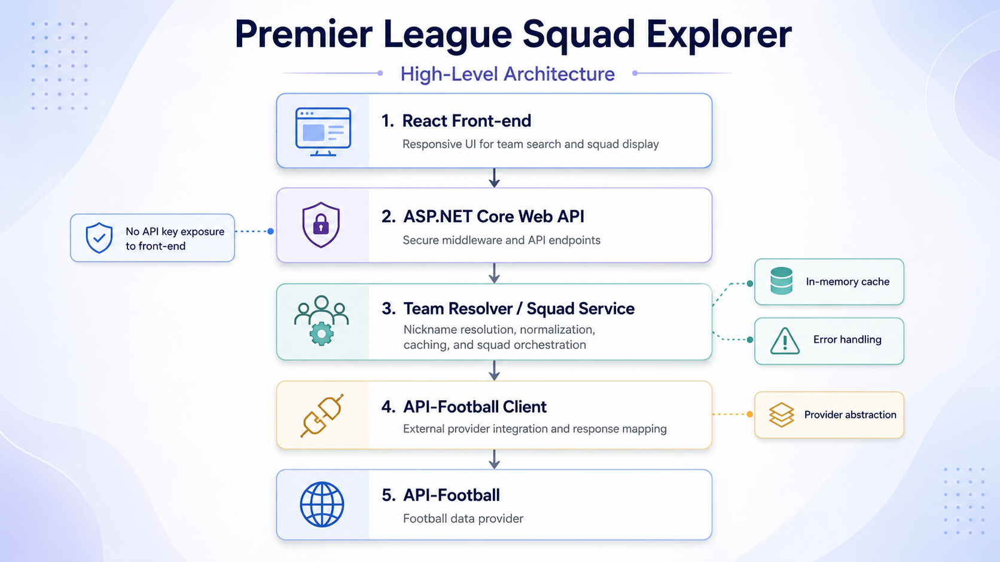

# Premier League Squad Explorer

## High-Level Design Document

## 1. Problem Statement

The goal of this assignment is to build a full-stack proof of concept that allows a user to search for an English Premier League club and view squad player information.

The solution should demonstrate a clean end-to-end flow:

- a React front-end for search and data presentation;
- a C# ASP.NET Core Web API back-end;
- integration with an external football data provider;
- clear error handling, caching, configuration, and documentation.

The project is intentionally designed as a proof of concept, not a production-scale football data platform.

## 2. Requirements Summary

The core requirements are:

- allow users to search for an EPL club;
- display squad player information;
- show player profile picture, first name, surname, date of birth, and playing position;
- keep the external API key on the server side;
- handle loading, error, empty, and missing-data states;
- document the architecture and setup clearly.

Additional implemented capabilities include:

- nickname search, for example `The Hammers`;
- in-memory caching to reduce repeated external API calls;
- Swagger/OpenAPI support;
- automated back-end tests;
- GitHub Actions CI pipeline.

## 3. Solution Overview

The solution consists of three main parts:

1. **React front-end**
   Provides the user interface, team search experience, player cards, and responsive layout.

2. **ASP.NET Core Web API back-end**
   Acts as middleware between the front-end and API-Football. It owns provider integration, team resolution, caching, mapping, and error handling.

3. **API-Football integration**
   Supplies Premier League team and player data.

The front-end never calls API-Football directly. This keeps the API key secure and gives the back-end full control over provider-specific behavior.

## 4. Architecture Diagram



The high-level request flow is:

```text
React Front-end
      |
      v
ASP.NET Core Web API
      |
      v
Team Resolver / Squad Service
      |
      v
API-Football Client
      |
      v
API-Football
```

## 5. Front-end Design

The front-end is implemented with React, TypeScript, Vite, Bootstrap, Bootstrap Icons, and SCSS.

The UI is designed as a clean sports dashboard rather than a heavy football-themed website. The focus is on clarity, responsiveness, and a smooth demo experience.

Main front-end responsibilities:

- collect the search query;
- show team search hints and examples;
- call the C# back-end API;
- render loading, empty, error, and success states;
- display squad players in responsive cards;
- handle missing or broken player images with a fallback placeholder;
- support mobile, tablet, desktop, and large-screen layouts.

The front-end API client uses the configured back-end base URL from `VITE_API_BASE_URL`. The API key is not exposed to the browser.

## 6. Back-end Design

The back-end is implemented as an ASP.NET Core Web API.

Main back-end responsibilities:

- expose clean API endpoints for the front-end;
- integrate with API-Football through a typed HTTP client;
- resolve user input to a supported EPL club;
- support official names, provider names, aliases, and nicknames;
- map provider-specific response models into stable DTOs;
- cache repeated team and squad lookups;
- handle provider failures and unexpected errors through centralized middleware.

The back-end is structured around clear responsibilities:

- `Controllers` expose HTTP endpoints;
- `Services` contain team resolution and squad orchestration logic;
- `Clients` contain API-Football integration logic;
- `Models` contain DTOs and provider response models;
- `Options` contain typed configuration;
- `Middleware` contains centralized error handling;
- `Data` contains JSON-based team alias configuration.

## 7. API Endpoints

### Get supported teams

```http
GET /api/teams
```

Returns supported EPL clubs using application-level DTOs.

### Get squad by team name or nickname

```http
GET /api/squads?query=The%20Hammers
```

Returns squad player data for the resolved club.

Example search inputs:

```text
Arsenal
Manchester United
West Ham United
The Hammers
Hammers
```

## 8. Team Resolution and Nickname Search

Team resolution is handled on the back-end.

The resolver supports:

- official club names;
- provider-specific names;
- common aliases;
- selected nicknames.

The alias dictionary is stored in:

```text
backend/src/PremierLeagueSquadExplorer.Api/Data/team-aliases.json
```

Example:

```text
The Hammers -> West Ham United
```

Input is normalized before matching. This allows the system to handle differences in casing, extra spaces, punctuation, and common name variants.

Nickname search was implemented through the same resolver used for provider name mapping. This keeps the design simple and avoids duplicating lookup logic.

## 9. External API Integration

API-Football is used as the external football data provider.

The back-end calls API-Football for:

- Premier League team data;
- player data for a resolved team.

Provider-specific response models are isolated inside the back-end. The front-end receives only clean application DTOs.

The API key is loaded through configuration / user secrets and is never committed to source control.

## 10. Caching Strategy

The solution uses in-memory caching because this is a proof of concept and does not require distributed persistence.

Caching is used for:

- supported team data;
- squad data per team and season.

This reduces repeated calls to API-Football during local testing and demo usage.

The caching approach is intentionally simple:

- no database dependency;
- no external cache dependency;
- easy to explain and validate;
- sufficient for the assignment scope.

For a production system, a distributed cache such as Redis would be considered.

## 11. Error Handling

The back-end uses centralized exception handling middleware.

Handled scenarios include:

- invalid input;
- team not found;
- API-Football provider errors;
- API-Football rate limits;
- unexpected server errors.

The API returns clean error responses to the front-end, for example:

```json
{
  "code": "TEAM_NOT_FOUND",
  "message": "The requested team could not be found."
}
```

Provider-specific diagnostic details are logged on the back-end but not exposed to the browser.

The front-end displays user-friendly error states instead of raw technical failures.

## 12. Security and Configuration

The API-Football key is stored server-side only.

Configuration is handled through:

- `appsettings.json` for non-secret configuration;
- .NET user secrets for local API key storage;
- environment variables where appropriate;
- `.env.local` for the front-end back-end base URL.

The front-end only stores the C# API base URL. It does not store or use the API-Football key.

CORS is configured for local front-end development.

## 13. Testing and Validation

Automated tests focus on the back-end because the main business logic lives there.

The test suite covers:

- team name normalization;
- official team resolution;
- nickname mapping;
- invalid input;
- unknown team handling;
- squad mapping;
- missing player data;
- missing player photo handling;
- player de-duplication;
- caching behavior;
- provider/API failure behavior;
- controller-level error responses.

Manual validation was performed for the front-end user flows:

- official club name search;
- nickname search;
- loading state;
- empty state;
- error state;
- missing or broken image fallback;
- responsive layouts across mobile, tablet, desktop, and large screens.

## 14. CI/CD

The repository uses a lightweight GitHub Actions pipeline.

The pipeline validates:

- back-end restore;
- back-end build;
- back-end tests;
- front-end dependency installation;
- front-end production build.

The workflow runs on pull requests and pushes to the main branch and can also be triggered manually.

Deployment is intentionally out of scope for this proof of concept. The CI pipeline focuses on validation and reviewer confidence.

## 15. Technical Challenges

### API-Football provider naming

API-Football does not always use the same names users expect. For example, a user may search for `West Ham United`, while the provider may expose the team as `West Ham`.

This was solved through a JSON-based alias dictionary and a normalization step.

### Nickname support

Nickname search is implemented through the same team resolver used for official and provider names. This avoids adding a separate nickname-specific code path.

### Provider limitations

API-Football free plans can have request and pagination limitations. The application handles provider errors defensively and logs diagnostic details on the back-end.

### Missing player data

The provider may return incomplete player data. The back-end maps missing values defensively, and the front-end renders fallback states where needed.

## 16. Trade-offs

### In-memory cache instead of persistent storage

In-memory caching is enough for this proof of concept. It keeps the implementation simple and avoids unnecessary infrastructure.

For production, distributed caching or persistent storage would be considered.

### Full squad response instead of UI pagination

The back-end returns the available squad data as a complete response. The front-end displays all returned players.

This keeps the API contract simple and is acceptable because the data size is small.

### Manual front-end validation instead of automated UI tests

Automated testing was focused on the back-end logic, where most of the business rules and provider integration decisions live.

The front-end was manually validated across the main user flows and responsive breakpoints.

### No deployment

Deployment was kept out of scope to focus on the assignment’s core requirements: architecture, implementation, tests, documentation, and CI validation.

## 17. Limitations

Known limitations:

- only the English Premier League is supported;
- the configured season is 2024;
- the application depends on API-Football data availability and plan limits;
- player data quality depends on the external provider;
- in-memory cache is reset when the application restarts;
- no production deployment is included;
- no distributed tracing or monitoring is included.

## 18. Future Improvements

Possible future improvements:

- deploy the application to a cloud environment;
- add end-to-end tests;
- add React component tests;
- add distributed caching;
- add retry and backoff policies for provider calls;
- add structured logging and correlation IDs;
- add player sorting and filtering;
- add more detailed squad metadata;
- support multiple leagues and seasons;
- add observability dashboards;
- add production-grade secret management.

## 19. Delivery Summary

The solution delivers a working full-stack proof of concept with:

- React front-end;
- ASP.NET Core Web API back-end;
- API-Football integration;
- nickname search;
- caching;
- error handling;
- tests;
- CI validation;
- reviewer-friendly documentation.

The implementation is intentionally scoped to be simple, explainable, and aligned with the assignment requirements.
